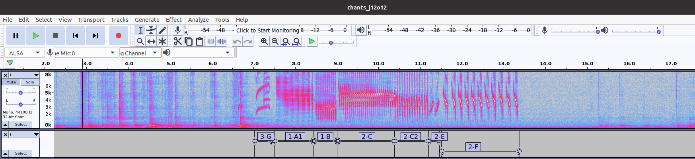
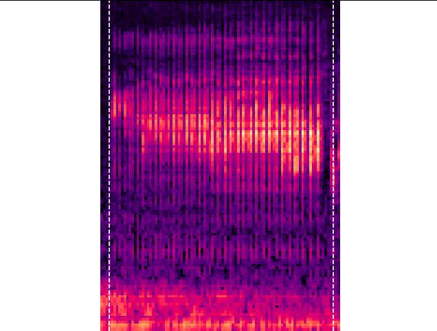
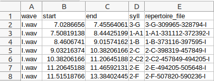
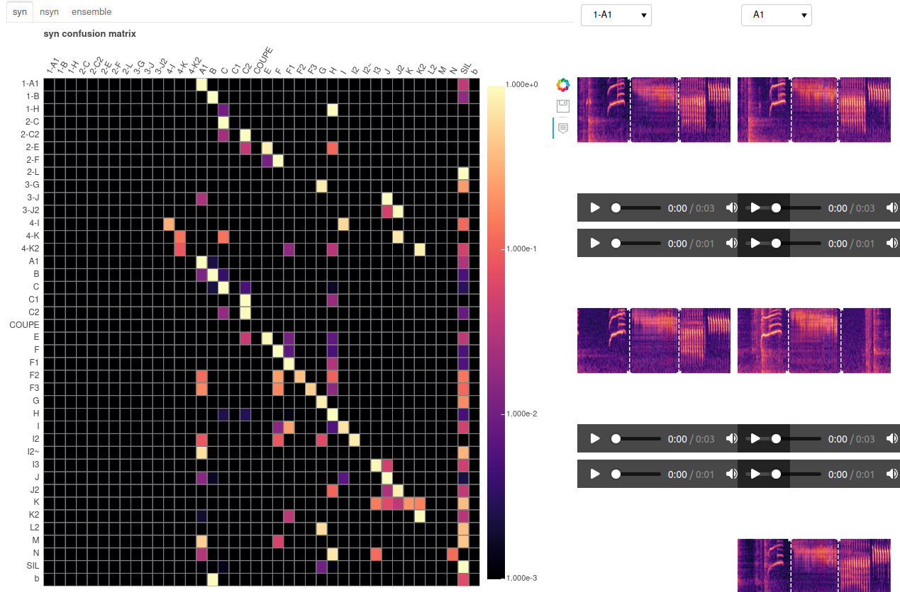
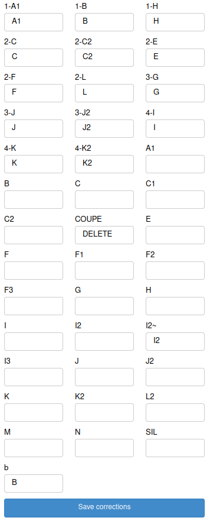
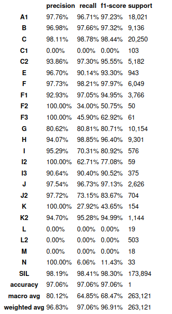
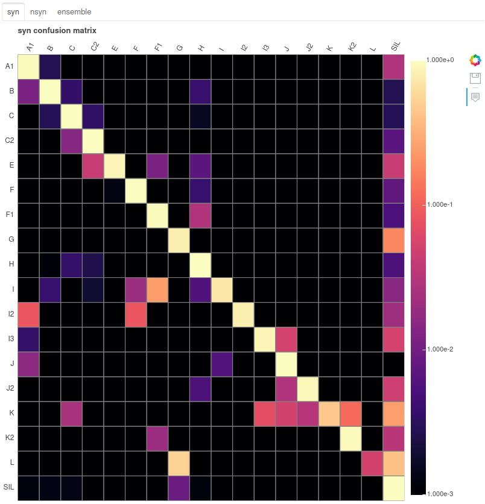

# Tutorial
In this tutorial we will demonstrate step by step the training of a predictive model based on few annotated songs.
After following this tutorial, you will be able to:
- get corresponding CSV from an Audacity file composed of waves and their annotations,
- build a model based,
- make annotations with this model on non annotated data.

**Summary:**
- [1. Installation](#installation)
- [2. Prepare the data](#prepare_data)
- [3. Run the dashboard](#dashboard)
- [4. Use the models on another dataset](#annotate)
- [5. The Config object](#config_object)

## Installation <a name="installation"></a>

Canapy dashboard and tools can be installed using pip on the following repository:

```bash
pip install -e git+https://gitlab.inria.fr/ntrouvai/canapy.git
```

or by installing a local copy:

```bash
pip install -e <path to canapy directory containing setup.py>
```

(this might take a while, consider downloading the zipped repository and installing it locally instead if you don't have a good connection.)

## Prepare the data <a name="prepare_data"></a>
In order to train a model to predict annotations you have to feed it songs (**wave files**), corresponding annotations (**CSV files**) and some specific JSON files such as corrections.json, vocab.json or config.json if you want to change the configuration parameters of audio manipulations.
If you have an Audacity file containing your songs and corresponding annotations Canapy is also able to transform it to the right format for the model to be trained.

### Export annotations from Audacity

Audacity is a free and open-source software, with which you can manipulate audio files and annotate your bird songs. Your songs and annotations would have this aspect on the Audacity software:
<br/> 
On the first line you can see the spectrogram of the song and on the second line the corresponding annotations track.
Make sure that your audio files contain only one song per file.

Consider the following project storing some bird songs and annotations in Audacity .aup format:

```
project
├── bird1
│   ├── songs0.aup
│   ├── songs0_data
│   ├── songs1.aup
│   └── songs1_data
├── bird1_dataset
```

Your directories don't have to have the same names as above, just make sure to enter the name you gave them in the command line. 
In a terminal running in the `project` directory, run :

```bash
python -m canapy.audacity -r ./bird1 -o ./bird1_dataset/
```

This will prompt you to confirm the exportation of the annotations and audio found in the Audacity files.
This will then produce the following tree:

```
├── bird1
│   ├── songs0.aup
│   ├── songs0_data
│   ├── songs1.aup
│   └── songs1_data
├── bird1_dataset
    ├── data
    └── repertoire
```

The `data` directory stores all annotations tracks in CSV files. 
The `repertoire` provides you extract of phrases based on the annotations: 
- png of spectrograms:
<br/> 
- and sound of the phrase (not the entire song).
annotations in the dataset. You can disable it by removing the `-r` option when calling canapy.audacity.

As stated before, you could also add JSON files such as corrections.json, vocab.json or config.json:
- corrections.json: if you already have some corrections in mind or if you already have a corrections.json file from a previous training (checkpoint or final version) you can put it here. You can check an example for this file here: [corrections.json example](#corrections_json) ;
- vocab.json: if you already know the precise list of vocabulary of your dataset you can make a JSON file like this. Here is an example: [vocab.json example](#vocab_json) ;
- config.json: this is the configuration file of the trained model, it contains audio manipulation parameters such as the sampling rate. If you want to modify it please check the [Config object](#config_object) part.

### CSV files
The columns of the annotations CSV needed to train models with Canapy are:
- wave: the name of the audio track (the .wav file representing the annotated song).
- start: the beginning of the annotation on the audio track, in seconds
- end: the end of the annotation on the audio track, in seconds
- syll: the annotation label
- repertoire_file: the name of the repertoire entry stored in the `repertoire` directory. (if you used the Audacity extractor and `-r` parameter)

Below, an example (this CSV corresponds to the song displayed in the Audacity example above):
<br/> 

### Recap of structure format
Thus, the basic data you need to train the model is a repertoire like this:
```
├── bird1_dataset
    └── data
        ├── song1.csv
        ├── song1.wav
        ├── song2.csv
        ├── song2.wav
        ...
        ├── songN.csv
        └── songN.wav
```

Before running the dashboard you can divide your data into two repository (training and testing), in case you would like to see the results on new data by yourself. However, this process is not mandatory, Canapy already splits the data for the training of the model.   

## Run the dashboard <a name="dashboard"></a>

You can now launch the dashboard to train the annotation models and check the quality of the dataset.

To run the dashboard, simply do:
```bash
python -m canapy ./bird1_dataset ./bird1_output
```

The dashboard should open in your browser, at localhost:9321. If not, simply reach localhost:9321 in your favorite browser.
All the data produced by the dashboard (models and checkpoints) will be stored in `./bird1_output`.
The first dashboard you will see in the one devoted to train the model.

### Dashboard 1: train

Click on the button `start training` to begin the training of the models and then produce the annotations. Metrics should display in the terminal where you started the dashboard. 
At the end of the training sequence, click on "Next step" to display the "eval" dashboard (it can take some time to display, don't worry, click only **once** on the button).
The first dashboard will train annotation models on the current version of the dataset, and produce their respective versions of the annotations.

Two models are built during the training phase. They both are based on an Echo State Network (ESN), a kind of artificial neural network, and have the same parameters. They are, however, trained on two different tasks:
- the **syn** model (syntactic model) is trained to annotate whole songs. Entire songs and annotations files are presented to the models during training. Thus, the model is trained only on the available data, meaning that imbalance in number between the categories of bird phrases is preserved. The model is also expected to rely on syntactic information to produce its annotations, being trained on the real order of the phrases in the songs.
- the **nsyn** model (non syntactic model) is trained to annotate only randomly mixed phrases, with an artificially balanced number of phrases samples. This model is expected to rely only on inner characteristics of each type of syllables to annotate the songs, without taking into account their context in the song. Imbalance in number is also *not* preserved, meaning the model has to give the same importance to all categories of syllables.

Finally, a third model, called **ensemble**, combine the outputs of the two previous models with a vote system, to combine the "judgements" of the two models in a new one.

### Dashboard 2: eval

The second dashboard displays the performances of the three models during the *real* annotation task: all three models are fed with the whole songs contained in the hand-annotated dataset, and we will now look at the differences between their annotations and the handmade ones.

This dashboard is divided in two parts: 
- the Class merge dashboard 
- the Sample correction dashboard
You can switch between them with the buttons at the top of the dashboard.

#### Class merge
In the `Class merge` dashboard, you can use the confusion matrices to inspect syllables categories where the models make a lot of mistakes. If the mistake pattern seems stable (high confusion between two classes, and potential agreement between the models), this could be the sign that the confused categories could be merged into one. This happens a lot on handmade annotations, due to obvious spelling mistakes in the annotations labels, or to disagreement in the naming between the human annotators, or to "over-classification" of certain patterns.
<br/> 
You can use the inspector at the right of the confusion matrices (clicking on the two buttons at the top right of the above screenshot) to display some class samples and see if a merge is coherent. When you have taken your decision, simply write the new name of the class you want to modify in the correction panel at the extreme right of the dashboard (for example, if you want to merge categories A and A1, because they are really close, simply write "A" under "A1" class text input).
If the class contains few samples and doesn't seem well-founded you can delete it by writing 'DELETE' in the text input under the name of the syllable category. Sometimes, some classes contains very few instances that are not sufficient for the model to recognize them, meaning they will not be usable. In this case making a 'TRASH' class is a good idea. 
<br/> 

Make sure to click on the `Save corrections` button under the syllable types input text to save your changes.

Moreover, you can find help to make corrections while looking to the metrics indicated under the confusion matrix. 
<br/> 
<br/> For example here the models achieve 97.06% accuracy each which is pretty good. However, you can see classes like C1, L, L2... that scores 0% in precision, recall and f1-score, meaning they may be deleted. If you choose to keep this model it will do a great job detecting the other classes but may lack experience recognizing the phrases labeled as C1, L,L2...


#### Sample correction
You can also inspect the samples about which the models disagree the most in the `Sample correction` dashboard. Here, all the annotations that are confused with another class over at least 2/3 of their time length by the models can be displayed, and manually corrected (the 2/3 time length disagreement parameter can be changed in the configuration file (see section 6.)). 
Again, at the right of the bar plot showing the disagreements' distribution, an inspector allows you to display samples of all the categories of syllables. 
The models aren't always right, as they use prediction you have the last word on which label to attribute to a phrase.
If the sample correction is empty, don't panic! it only means that the models performs well (maybe too well?) on the dataset. It is often the case with little datasets, where the models overfit the misrepresented categories of syllables. In any way, you should first focus on merging whole categories of syllables before correcting single samples.

Make sure to click on the `Save all` button on the right of the distribution figure to save your changes.

### Next step
You have two choices then:

- click the `Next step` button. This will redirect you to the 'train' dashboard. Indeed, after you have applied corrections on the dataset, you should retrain the models to see the increase in performance, and to check if by changing the data distribution new disagreements do not appear. You should do 3-4 iterations of training-evaluating to be sure that you have fixed all the annotations.
Below, the comparison of the initial confusion matrix of the syntactic model and its matrix after some corrections:
<br/>   
- click the `Export` button. If you are happy with the models performances and the annotations' distribution of the dataset, after some iterations, you can click on this button to be redirected to the 'export' dashboard. This dashboard will simply retrain all the models with all the corrections applied on the dataset, and save them in the output directory, with the correction file, the configuration file, etc.

In any case, a checkpoint of the current state of your analysis will be saved : corrections, configuration, models and annotations will be stored in the `output/checkpoint` directory, in a subdirectory named after the iteration number (`1` if it is your first run, `2` if it is the second time you apply corrections and train models, and so on).

### Output directory
After training your model you will find in the `./bird1_output` directory:
- `checkpoints`: corrections, configuration, models and annotations corresponding to a round of training, in a subdirectory named after the iteration number (`1` if it is your first run, `2` if it is the second time you apply corrections and train models, and so on).
- `models`: 'syn' and 'nsyn' program corresponding to the final version of the syntactic and non syntactic models you have trained
- `annotations.json`: a JSON file containing all the annotations for the songs, if you want to open it, do that with Python, a Text Editor will crash.
- `config.json`: a JSON file containing the models' parameters, you can know more about it in the [Config object](#config_object) part.
- `corrections.json`: a JSON file containing your class merges and sample corrections round after round, it looks like this: <a name="corrections_json"></a>
```json
{
    "0": {
        "syll": {},
        "sample": {}
    },
    "1": {
        "syll": {"1-A1": "A1", "1-B": "B","I2~": "DELETE", "L2": "G"},
        "sample": {"1116": "K2", "1443": "F1", "2001": "F1"}
    }, 
    ...
    "5": {
        ...
    }
}
```
- `vocab.json`: a JSON file listing all the syllable categories, it looks like this: <a name="vocab_json"></a>
```json
[
  "A1","B","C",...
]
```

## Use the models on an other dataset <a name="annotate"></a>

Now that you have produced 2 neural networks and an ensemble model to correctly annotate bird songs, you can apply them on not annotated data.  
To do so, we will use the `canapy` simple API, and a little of Python.
  
This part can be executed using the Jupyter Notebook: `Tutorial_annotating_with_canapy`, available in the Canapy folder.  

First, in a coding environment, create an Annotator object:  

```python
from canapy import Annotator

annotator = Annotator("./bird1_output/models")
```
This object will call every function you need to produce annotations from the dataset, using the models we've trained in the dashboard. Make sure that the reservoirpy version you are using is the same as the one used for the model training, otherwise it won't work.  

In this example, the `./bird1_non_annotated_songs` directory contains only .wav audio files, one per song, ready to be annotated.  

The Dataset object may look new to you, but it is in fact already used in the backend of the dashboard. It stores the dataset in the form of a Pandas Dataframe (in this case, only paths to audio files), but can also store annotations, corrections, configuration files, and apply everything to the audio and labels to correct them and extract the features needed by the models to annotate them. For now, we only need them to store the audio files and the configuration file, which is here by default. It also automatically creates the class "SIL", which represents all the non annotated (and thus silent) part of the songs.  

```python
from canapy import Dataset

dataset = Dataset("./bird1_non_annotated_songs", vocab = annotator.vocab)
```

To run the annotator, simply call (it could last a bit long depending on how many songs you have to annotate):

```python
annotations, vectors = annotator.run(dataset = dataset)
```

That's it! The `annotations` variable now looks like a dictionary:

```json
{
    "syn": {
        "000-song-name.wav": ["SIL", "SIL", "A", "A", "A", "B", "C"...],
        "001-song-name.wav": [...],
        ...
    },
    "nsyn": {
        ...
    },
    "ensemble": {
        ...
    }
}
```

This dictionary stores all the annotations of the syntactic model, with the audio file name attached. If you want to annotate with the other models (non syntactic and ensemble) you can do it by specifying the parameter model to nsync, ensemble, or all.  

The `vectors` variable looks the same, but stores the raw responses of the models (the output vectors representing the decision of the neural network).   

Notice that the annotations look like they are repeating in time a lot. To export only the sequence of annotations in time, not all annotations for all timesteps, simply set the `to_group` argument to  `True` when calling the annotator:  

```python
annotations, _ = annotator.run(to_group=True)
```

The annotations will now look like this:
```json
{
    "syn": {
        "000-song-name.wav": [("SIL", 2), ("A", 3),  ("B", 1)...],
        "001-song-name.wav": [...],
        ...
    },
    "nsyn": {
        ...
    },
    "ensemble": {
        ...
    }
}
```

The annotations have been grouped. The number that comes along each annotation label is the number of timesteps covered by the annotation, i.e. the duration of the bird phrase, in number of spectral analysis windows. This number can be easily converted in seconds knowing the sampling rate and the time jumps between each analysis windows, but this can of course lead to huge approximations.

If you really need to display this time in seconds, simply use:

```python
new_annotations = to_seconds(annotations, dataset.config)
```
Be careful, this function works with the grouped annotations from one model. Hence, you shouldn't give it the annotations produced by `annotator.run(model='all',dataset=dataset,to_group=True).`  

We will explain in the [Config object section](#config_object) how the configuration stored in the dataset works.

Finally, you can directly save these annotations in CSV files by using the csv_directory parameter. This parameter take the path where you want to save the new CSV as input. Moreover, this parameter automatically activates the grouping function, you don't have to specify it to get a concise CSV.  

```python
annotations, _ = annotator.run(dataset=dataset,csv_directory="./tuto_non_annotated_songs_annotated")
```


## The Config object <a name="config_object"></a>

Modifying this object could be useful if you are manipulating other birds than canaries (changing the sampling rate for example) Configuration can be changed by creating a JSON file suffixed  `.config.json`. 

A configuration file looks like this. All the keys are mandatory:

```json
{
    "syn": {
        "N": 1000,
        "sr": 0.4,
        "leak": 1e-1,
        "iss": 5e-4,
        "isd": 2e-2,
        "isd2": 2e-3,
        "ridge": 1e-8
    },
    "nsyn": {
        "N": 1000,
        "sr": 0.4,
        "leak": 1e-1,
        "iss": 5e-4,
        "isd": 2e-2,
        "isd2": 2e-3,
        "ridge": 1e-8
    },
    "sampling_rate": 44100,
    "n_fft": 0.025,
    "hop_length": 0.01,
    "n_mfcc": 20,
    "lifter": 40,
    "fmin": 500,
    "fmax": null,
    "mfcc": true,
    "delta": true,
    "delta2": true,
    "padding": "wrap",
    "min_class_duration": 30,
    "min_silence_duration": 0.2,
    "min_analysis_window_per_sample": 2,
    "min_correct_timesteps_per_sample": 0.66,
    "min_frame_nb": 2,
    "keep_separate": [
        "cri"
    ],
    "test_ratio": 0.2,
    "seed": 1234
}
```

We won't explain everything, as you should not change most of these parameters in any case. This is what you need to know when creating your own configuration file :

- the `syn` and `nsyn` keys store the ESNs parameters, and should not be changed unless you really know what you are doing.
- the `sampling_rate`, `hop_length` and `n_fft` keys controls the audio and spectral representations of the song, respectively the sampling rate, in Hz, the length of the jump between to spectral analysis windows, in seconds, and the length of the analysis window, in seconds. These parameters should also not be changed, as the ESNs parameters heavily depends on them. But you will probably have to use it if you want to analyze the annotations, as one annotation per spectral window is produced by the ESN.
- the `min_class_duration` key controls what should be the duration of all classes of syllables in the balanced dataset used during the nsyn training. By default, it is set to 30sec of song per class. If a class has too few examples to reach a 30sec duration, the Dataset object will produce clones of the samples until the duration is reached. Random noise will then be added to the clones to artificially make each clone unique.
- the `min_silence_duration` controls what is the minimum duration in seconds for a silence sample in the balanced dataset. It is set to 0.2 sec, to avoid training the nsyn model with very short samples.
- the `min_analysis_window_per_sample` controls what samples should be considered as irrelevant and removed of the dataset, because they are too shorts. By default, a sample should be represented by at least 2 timesteps in the preprocessed dataset.
- the `min_correct_timesteps_per_sample` key controls which samples should be considered as "bad" in the sample correction dashboard. By default, if 66% of the timesteps representing an annotation are badly annotated by a model, then this annotation is considered as a source of disagreement and will be displayed in the sample correction dashboard.
- the `keep_separate` key stores a list of syllables categories that should not be merged in the dataset even if neighbours in time. For example, the "cri" category, which represents canary calls that are not part of a song, should be always kept apart, because there is sometime a huge amount of silence between them.
- the `test_ratio` key controls what proportion of songs should be used as test songs when training the models.
- the `seed` key is really important and controls all the stochastic systems of Canapy. It should be fixed, to ensure reproducibility. Also, if you want to statistically validate a correction run, you should rerun the dashboard several times with different seeds.

You can create your own configuration file by adding it in the directory where the dataset is loaded. For example, a good dataset directory structure would be:

```
└── dataset
    ├── audio+labels
    └── myconfig.config.json
```

Where the  `audio+labels` directory could be the output of the Audacity converter, or just some audio files. If you call a Dataset object at the root of the `dataset` directory, the configuration file will be automatically loaded.

In a program, you can then access the configuration through the `config` attribute of a Dataset object. All the keys of this `config` can be accessed like regular attributes or like dict keys:

```python
config = dataset.config

sampling_rate = config.sampling_rate
sampling_rate = config["sampling_rate"]
```

## Support

If you have any problems with using Canapy, don't hesitate to contact Nathan Trouvain or Albane Arthuis at Inria Mnemosyne team:
nathan.trouvain@inria.fr
albane.arthuis@inria.fr